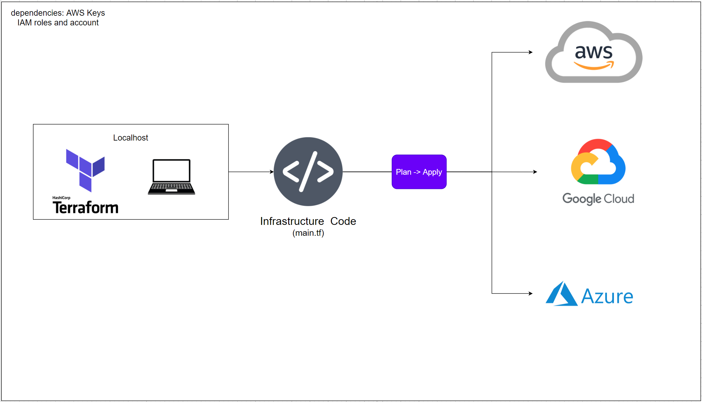

### Terraform



## Getting started
After installing Terraform onto your machine, create a new folder where you will be creating a `main.tf` file. In the file write down this code:
```
provider "aws" {
	region = "eu-west-1"
}

resource "aws_instance" "app_instance"{

	key_name = "your_key" # Has to be in your .ssh folder
	ami = "ami-0943382e114f188e8"
	instance_type = "t2.micro"
	associate_public_ip_address = true

	tags = {
		Name = "name_of_instance"
	}
}
```

If you don't already have your AWS keys saved in your environment variables, do so by naming them `AWS_ACCESS_KEY_ID` and `AWS_SECRET_ACCESS_KEY`.
Open up terminal/cmd in the folder and run `terraform init` then `terraform plan`. If that was successful run `terraform apply` to create the instance.

## Automating Absoloutely Everything
Here you can bunch every resource into one files, multiple files or even one file per resource. Terraform treats it all the same.
### VPC
```
resource "aws_vpc" "prod-vpc" {
    cidr_block = "10.208.0.0/16"
    instance_tenancy = "default"    
    
    tags = {
        Name = "eng89_salem_vpc"
    }
}
```
### Subnet
```
resource "aws_subnet" "prod-subnet-public-1" {
    vpc_id = aws_vpc.prod-vpc.id
    cidr_block = "10.208.1.0/24"
    map_public_ip_on_launch = "true" //it makes this a public subnet
    availability_zone = "eu-west-1a"
    tags = {
        Name = "eng89_salem_subnet_public"
    }
}
```
### Internet Gateway
```
resource "aws_internet_gateway" "prod-igw" {
    vpc_id = aws_vpc.prod-vpc.id
    tags = {
        Name = "eng89_salem_ig"
    }
}
```
### Route Table
```
resource "aws_route_table" "prod-public-crt" {
    vpc_id = aws_vpc.prod-vpc.id
    
    route {
        //associated subnet can reach everywhere
        cidr_block = "0.0.0.0/0" 
        //CRT uses this IGW to reach the internet
        gateway_id = aws_internet_gateway.prod-igw.id
    }
    
    tags = {
        Name = "eng89_salem_rt"
    }
}
```
### Associating the Route Table to the Subnet
```
resource "aws_route_table_association" "prod-crta-public-subnet-1"{
    subnet_id = aws_subnet.prod-subnet-public-1.id
    route_table_id = aws_route_table.prod-public-crt.id
}
```
### App Security Group
```
resource "aws_security_group" "ssh-allowed" {
    vpc_id = aws_vpc.prod-vpc.id
    
    egress {
        from_port = 0
        to_port = 0
        protocol = -1
        cidr_blocks = ["0.0.0.0/0"]
    }
    ingress {
        from_port = 22
        to_port = 22
        protocol = "tcp"
        // This means, all ip address are allowed to ssh ! 
        // Do not do it in the production. 
        // Put your office or home address in it!
        cidr_blocks = [var.my_ip]
    }
    //If you do not add this rule, you can not reach the NGIX  
    ingress {
        from_port = 80
        to_port = 80
        protocol = "tcp"
        cidr_blocks = ["0.0.0.0/0"]
    }
    ingress {
        from_port = 3000
        to_port = 3000
        protocol = "tcp"
        cidr_blocks = ["0.0.0.0/0"]
    }
    tags = {
        Name = "eng89_salem_sg_app"
    }
}
```
### Uploading Files & Folders
Provisioner blocks are written inside and at the end of instance resources:
```
  provisioner "file" {
    source      = "upload/"
    destination = "~/"

    connection {
      type        = "ssh"
      user        = "ubuntu"
      private_key = file("~/.ssh/eng89_salem_ans.pem")
      host        = self.public_ip
    }
  }
```
### Executing Code Remotely (Inc Reverse Proxy)
```
  provisioner "remote-exec" {
    inline = [
      "sudo apt-get update -y",
      "sudo apt-get install -y dos2unix",
      "sed -i 's/replacewithip/${self.public_ip}/g' default", #replace text in file
      "dos2unix ~/provision.sh",
      "chmod +x ~/provision.sh",
      "sudo ~/provision.sh"
    ]

    connection {
      type        = "ssh"
      user        = "ubuntu"
      private_key = file("~/.ssh/eng89_salem_ans.pem")
      host        = self.public_ip
    }
  }
```